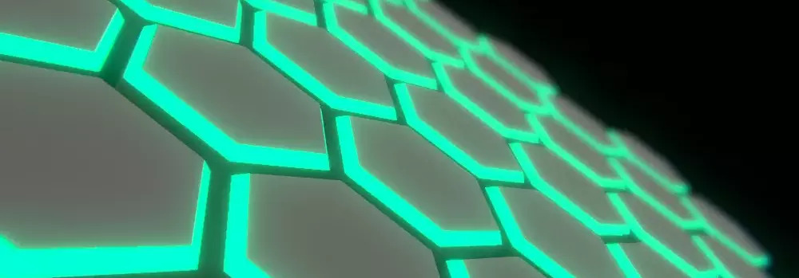

# Hi there 👋

### Hi, I'm student at [Bialystok University of Technology](https://pb.edu.pl/en/) and from time to time try to fight C# in struggle to make some games _(with not much success)_.

By the look of this profile you could clearly say i'm more interested in backend. :/

<h3 align="left">Languages and Tools:</h3>

    

###### _Above isn't mine work, i found this [cool generator on internet](https://rahuldkjain.github.io/gh-profile-readme-generator/) :P_

Contact:
- Mail: programistycznyswir@gmail.com
- Discord: [FreeDOOM#4231](https://discordapp.com/channels/@FreeDOOM/4231/)
- Nothing else... _(i'm rather bad at maintaining social accounts...)_
<!--
**ProgramistycznySwir/ProgramistycznySwir** is a ✨ _special_ ✨ repository because its `README.md` (this file) appears on your GitHub profile.

Here are some ideas to get you started:

- 🔭 I’m currently working on ...
- 🌱 I’m currently learning ...
- 👯 I’m looking to collaborate on ...
- 🤔 I’m looking for help with ...
- 💬 Ask me about ...
- 📫 How to reach me: ...
- 😄 Pronouns: ...
- ⚡ Fun fact: ...
-->
